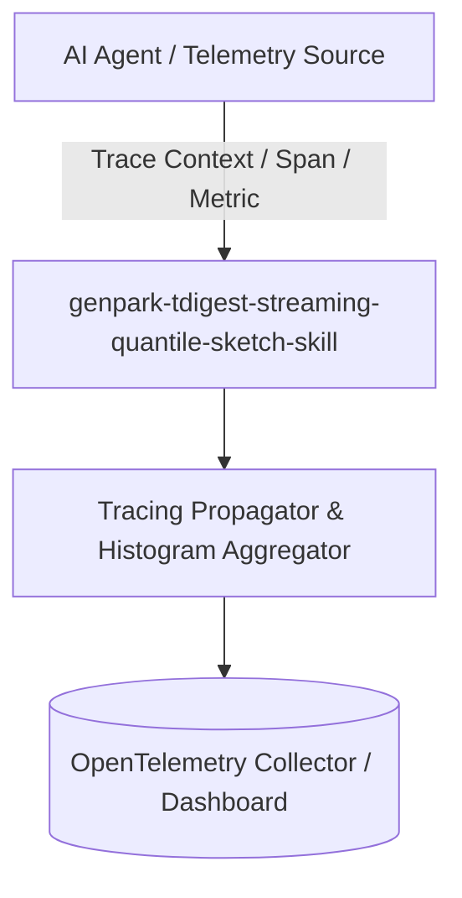

# genpark-tdigest-streaming-quantile-sketch-skill

[](https://github.com/alphaparkinc/genpark-tdigest-streaming-quantile-sketch-skill/actions)
[](https://opensource.org/licenses/MIT)
[](https://www.python.org/downloads/)

> t-Digest online streaming quantile estimation algorithm clustering centroid clusters for high-precision P99 and P99.9 latency SLAs.

## Architecture



## Features
- Pure standard library Python implementation with strictly zero pip dependencies.
- Production-grade telemetry principles (W3C traceparent, HdrHistogram, t-Digest, Dapper sampling).
- Native Model Context Protocol (MCP) server support for AI agent observability.

## Installation

```bash
git clone https://github.com/alphaparkinc/genpark-tdigest-streaming-quantile-sketch-skill.git
cd genpark-tdigest-streaming-quantile-sketch-skill
```

## Quickstart

```bash
python example_usage.py
```
